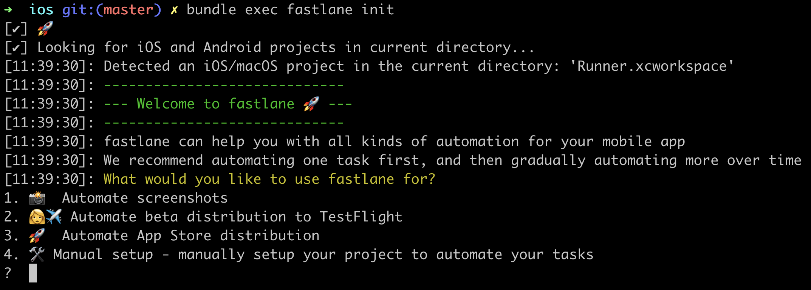

Flutter + Fastlane = 🚀
---

---
_**fastlane**_  handles tedious tasks so you don’t have to.
---

---

Setup Fastlane
---
```bash
$ gem install bundler
$ bundle init
$ echo "gem 'fastlane'" >> Gemfile
$ bundle install
$ cd ios
```

```bash
alias lane="bundle exec fastlane"
```

---

$ **lane init**
---



---

- Automatically create App ID on **Apple Developer Portal**
- Automatically create App on **Apple Store Connect**
- Configured **Appfile**
- Sample **Fastfile**

---

Appfile
```ruby
app_identifier("io.github.mugbug.fastlaneDemo")
apple_id("pedro.zaroni@dextra-sw.com")

itc_team_id("464910") # App Store Connect Team ID
team_id("JZ2QTNWLCN") # Developer Portal Team ID
```

Fastfile
```ruby
desc "Push a new beta build to TestFlight"
lane :beta do
  build_app(workspace: "Runner.xcworkspace", scheme: "Runner")
  upload_to_testflight
end
```

---

$ **lane beta**
---
<br>
** ARCHIVE FAILED **

❌  error: "Runner" requires a provisioning profile. Select a provisioning profile in the Signing & Capabilities editor. (in target 'Runner' from project 'Runner')

---

Avoid the **frustration** of managing code signing identities
--- 

Uncheck _Automatically manage signing_ =]

---

Using _**match**_
---

Using _**cert**_ and _**sigh**_
---

---

Using _**match**_
---

Private keys + certificates => Github private repo
- Easy to setup new machines with only the repo access
- No need to create a profile for each team member
- Secure 🔒
<br>
⚠️ _match_ requires to revoke existing certificates

---

Using _**cert**_ and _**sigh**_
---

- _cert_ will make sure you have a valid certificate and its private key installed on the local machine
- _sigh_ will make sure you have a valid provisioning profile installed locally, that matches the installed certificate

###### Mainly used if you don't want to revoke existing certificates

---

To get started, create a **new private Git repo** and run:

$ **lane match init**
---

###### https://codesigning.guide

###### Note: It's also possible to use gcloud or s3 to store the certificates/profiles

---

Matchfile
---

```ruby
# Repo where profiles and certs will be stored
git_url("git@github.com:mugbug/fastlane-demo-certs.git")

storage_mode("git")

# Apple Developer Portal username
username("pedro.zaroni@dextra-sw.com")
```

---

Creating new certificate and profile
```ruby
# Fastfile

desc "Download provisioning profiles"
lane :rematch do
  match(
    type: "appstore", # or development/adhoc
    # git_branch: "my-app",
    username: "pedro.zaroni@dextra-sw.com",
    force: true, # enable to refresh profiles
    # readonly: true, # enable to prevent refreshes
  )
end
```

---

$ **lane rematch**
---

- Generate new certificate and import to local machine
- Create new provisioning profile for Bundle ID
- Setup Passphrase for Match storage
- Encrypt and upload certificate and profile to git repo

---

Let's check Xcode's Signing & Capabilities
---

---

Sounds good, now let's try this again:

$ **lane beta**
---

---


---

Where to go from here?
---

- Version bump
- Screenshots
- Release notes
- Slack message
- Integrate with any CI tool
- ∞ -> beyond! 🚀

<br>

https://docs.fastlane.tools

---

fastlane.tools just saved you 40 minutes! 🎉
---
---

References:
---
- [fastlane docs](https://docs.fastlane.tools)
- [Automating Your App's Release Process Using Fastlane](https://www.youtube.com/watch?v=scfOk5SgrKU)
- [A new approach to code signing](https://codesigning.guide)
- [Continuous delivery with Flutter](https://flutter.dev/docs/deployment/cd)
- [Marp gist](https://gist.github.com/yhatt/a7d33a306a87ff634df7bb96aab058b5)